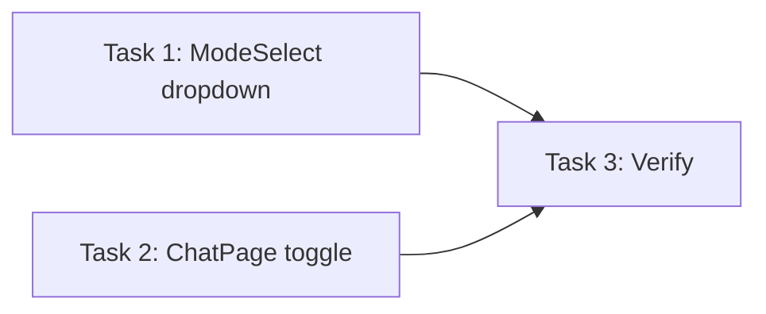

# Plan: YOLO Mode

**Design:** [./design.md](./design.md)
**Goal:** Add `bypassPermissions` mode to UI so users can auto-approve all tools

**Success Criteria:**
- [ ] YOLO mode appears in dropdown
- [ ] Shift+Tab cycles through all 4 modes
- [ ] Mode persists and works with SDK

## Task DAG

## Batches

| Batch | Tasks | After |
|-------|-------|-------|
| 1 | T1, T2 | — |
| 2 | T3 | B1 |

---

### Task 1: Add YOLO to ModeSelect.vue

**Type:** feature
**Files:** `src/webview/src/components/ModeSelect.vue`
**Steps:**
1. Add 4th DropdownItem for `bypassPermissions`
2. Update `selectedModeLabel` computed to handle new mode
3. Update `selectedModeIcon` computed to return flame icon

---

### Task 2: Update mode toggle in ChatPage.vue

**Type:** feature
**Files:** `src/webview/src/pages/ChatPage.vue`
**Steps:**
1. Add `bypassPermissions` to the `order` array in `togglePermissionMode`

---

### Task 3: Manual verification

**Type:** manual
**Steps:**
1. Open extension
2. Verify dropdown shows 4 modes
3. Verify Shift+Tab cycles through all 4
4. Test that YOLO mode actually auto-approves commands
